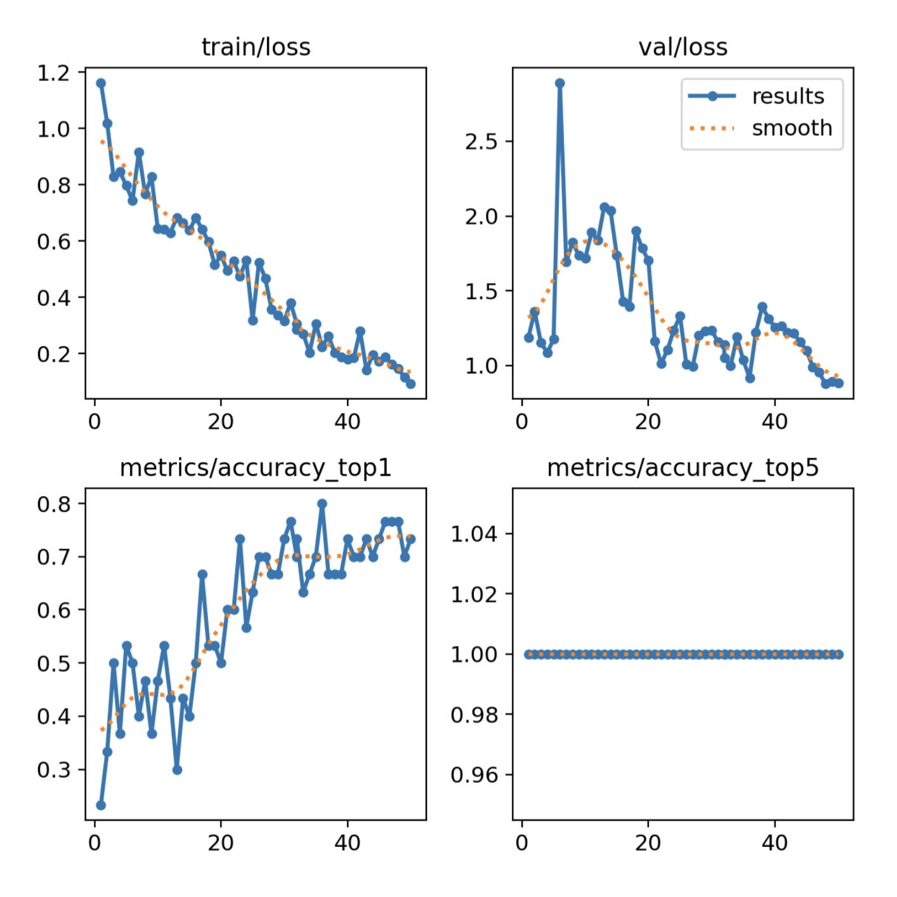
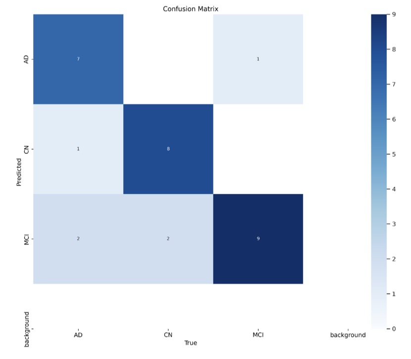
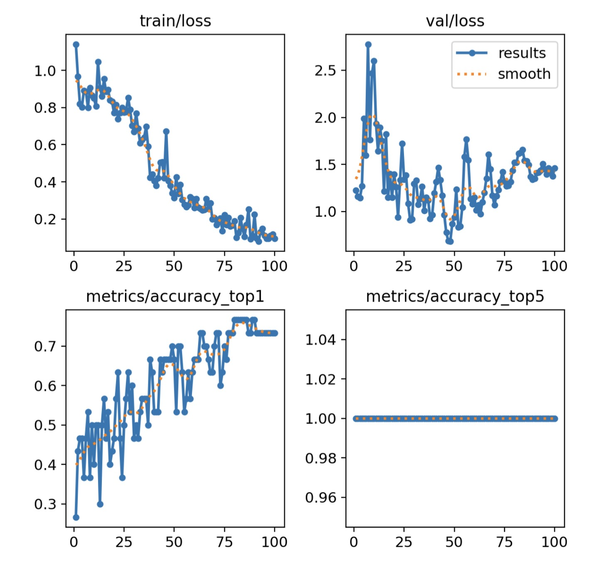
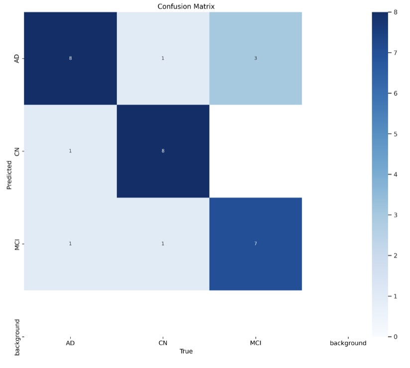

# YOLO-Based Classification of Cognitive States from Fused T1 and T2 MRI Modalities

This project implements a YOLO classification model to classify cognitive states (CN, MCI, AD) using fused T1 and T2 MRI images converted to RGB representations.

**Disclaimer:** This project is not a published or printed paper. It was developed as a practice exercise to explore research methodologies and does not claim originality of the underlying ideas. References to sources are included in the accompanying paper document.

## Methodology

The project employs YOLOv11 classification models (S and X variants) for multi-class image classification. Key concepts include:

- Data fusion: Combining T1 and T2 MRI modalities into RGB images (T1 as red channel, T2 as green and blue channels).
- Transfer learning using YOLO weights.
- Evaluation metrics: Precision, recall, F1-score, and confusion matrices for model performance assessment.

## Results

### YOLO11 S Model




### YOLO11 X Model




## Project Workflow

```mermaid
graph TD
    A[Raw T1 & T2 MRI Images] --> B[Fuse to RGB Images]
    B --> C[Categorize by Class (CN, MCI, AD)]
    C --> D[Split Dataset: Train/Val/Test]
    D --> E[Train YOLO Model]
    E --> F[Validate & Evaluate]
    F --> G[Generate Results & Metrics]
```
